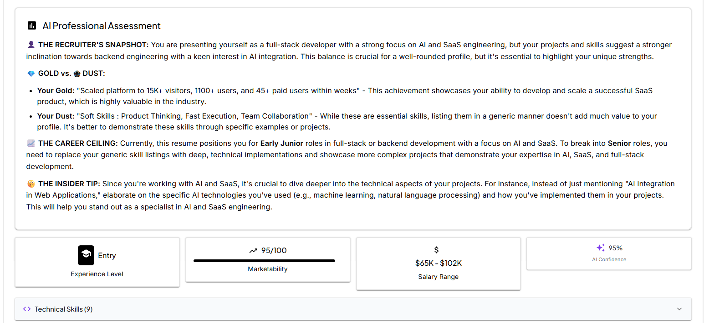
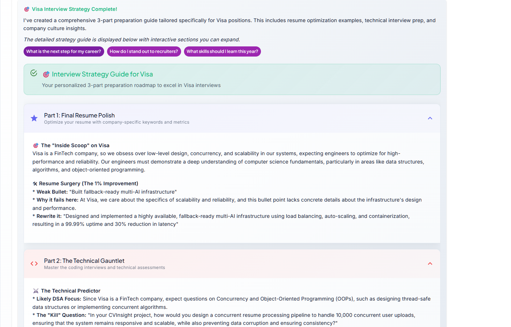
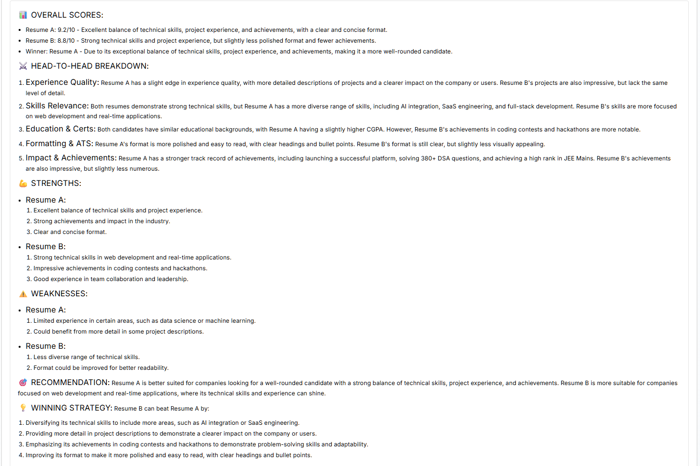

  <h1>The Best AI-Powered Resume Builder & ATS Scanner</h1>
  
  
  
  

  
<i>Stop fighting with formatting. Generate 1-page, ATS-optimized PDFs instantly using AI.</i>

  <h3><a href="https://www.cvinsight.me">Build Your Free Resume at CVInsight.me</a></h3>
   
  

---

## The Problem: Blank Page Anxiety and ATS Rejection
A second-year engineering student recently asked me: *"How do I make a resume from scratch?"* He had the skills and the projects, but he was stuck staring at a blank page, terrified of formatting errors and ATS auto-rejection. 

Your resume is the highest ROI investment for your career, but you shouldn’t need to become a designer or a LaTeX expert just to create one. I built CVInsight to bridge that gap and provide the analytical feedback you usually only get from senior recruiters.

  

---

## Pillar 1: The Build Engine & Resume Studio

### The Unlimited Resume Studio
Stop paying for basic PDF downloads. CVInsight includes an unlimited Resume Studio with 4 premium, easily interchangeable templates:
* **The Professional:** Single-column layout for strict ATS systems (FAANG, Finance).
* **The Modern:** 30/70 two-column layout for fast scanning (Startups, UI/UX).
* **The Creative:** Dark-mode terminal layout for Backend and DevOps engineers.
* **The Minimalist:** Typography-driven academic layout.

### Upload & Polish vs. LaTeX Power Builder
Whether you want to upload an existing PDF and let the AI extract and polish your text, or you want to generate raw, ATS-optimized LaTeX code to compile in Overleaf yourself, the Build Engine handles the heavy lifting instantly.

  

---

## Pillar 2: The Analytical Suite

### The Recruiter's Snapshot (AI Professional Assessment)
Stop guessing what recruiters think when they read your resume. Our AI analyzes your profile and generates a brutal, honest "Recruiter Snapshot" representing the first 60 seconds of a resume review. It identifies your **Gold** (the metrics you must highlight), your **Dust** (the filler words dragging you down), and calculates your current Career Ceiling based on market data.

  

### Company-Specific Interview Strategy
Select your target company, and the AI generates a comprehensive 3-part preparation roadmap. It performs "Resume Surgery" to optimize your bullet points for that specific company's engineering culture, and predicts the exact "Technical Gauntlet" (e.g., low-level design vs. algorithmic focus) you will face in the interview.

  

### Your Personal AI Career Consultant
Ask the AI specific questions about your career trajectory, skill gaps, and salary expectations based on your exact profile and current market data.

  

---

## Pillar 3: The Competitive Arena

### Resume Battle (Head-to-Head Breakdown)
Want to know how you stack up against the competition? Upload two resumes to the Resume Battle engine. The AI performs a granular head-to-head breakdown across Experience Quality, Skills Relevance, and ATS Formatting. It declares a winner and provides a "Winning Strategy" detailing exactly what the runner-up needs to do to close the gap.

  

### The College CVInsight Championship
Compete with students from your own college and across the nation. Get your CVInsight Score out of 100, see the top performers at institutes like NITs, IITs, and BITS, and find out exactly what you need to do to beat the national average.

  

---

## The Placement Playbook
A dedicated library of real, honest stories and practical roadmaps from successful candidates. Read case studies on how students went from 0 to 400+ DSA questions, maintained high CGPAs while building side projects, and cracked top tech internships.

---

### [Stop struggling with formatting. Get started for free at CVInsight.me](https://www.cvinsight.me)

 

*Built by a student, for students. If CVInsight helps you secure an internship or full-time offer, please consider dropping a star on this repository to help others find it.*
