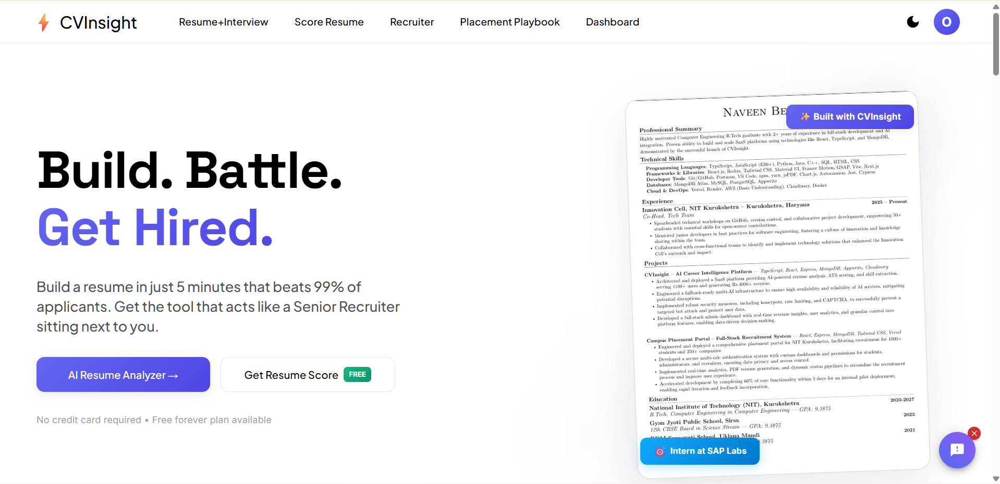
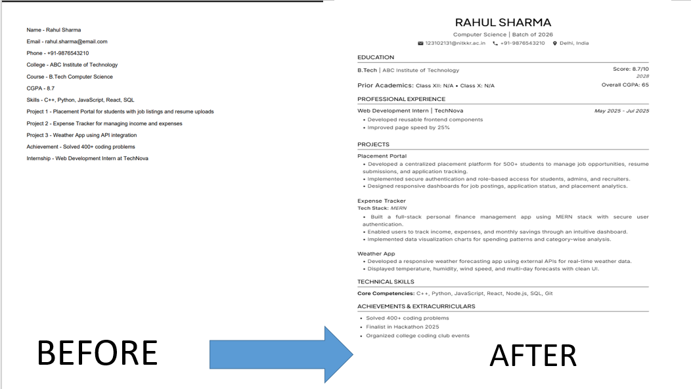
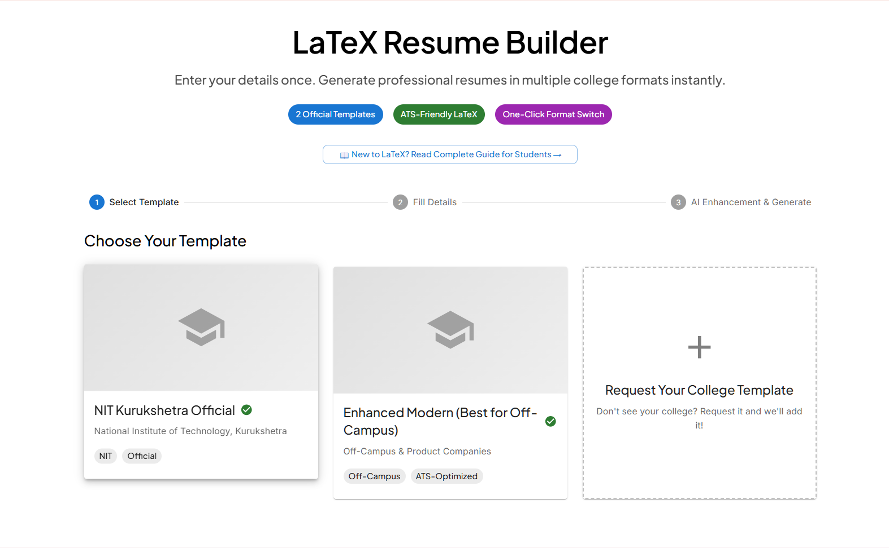
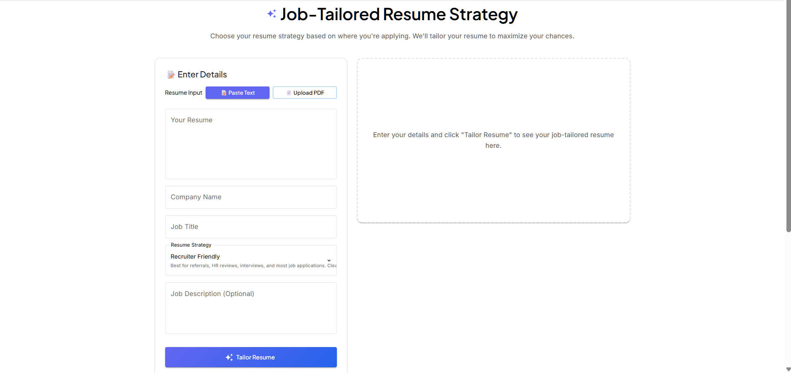
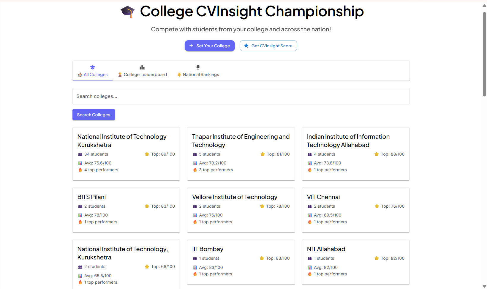
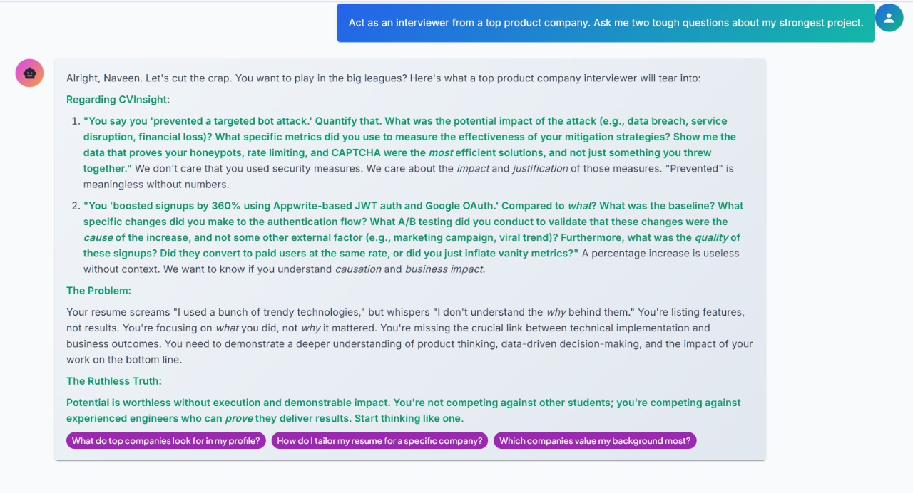
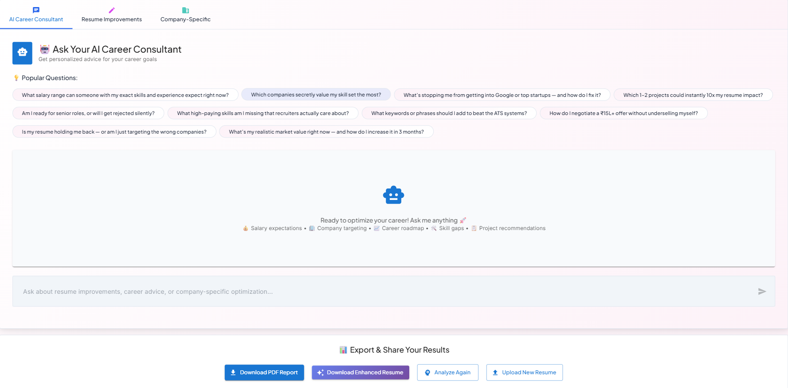

  <h1>The Best AI-Powered Resume Builder & ATS Scanner</h1>
  
  
  
  

  
<i>Stop fighting with formatting. Generate 1-page, ATS-optimized PDFs instantly using AI.</i>

  <h3><a href="https://www.cvinsight.me">Build Your Free Resume at CVInsight.me</a></h3>
   
  

---

## The Problem: Blank Page Anxiety and ATS Rejection
A second-year engineering student recently asked me: *"How do I make a resume from scratch?"* He had the skills and the projects, but he was stuck staring at a blank page, terrified of formatting errors and ATS auto-rejection. 

Your resume is the highest ROI investment for your career, but you shouldn’t need to become a designer or a LaTeX expert just to create one. I built CVInsight to bridge that gap. 

  

---

## Core Build Engine: Two Paths to Your Resume

### 1. Upload & Polish (For Speed)
Perfect if you already have a rough draft or a basic PDF.
* Upload your existing resume.
* The system extracts your profile automatically.
* Edit and improve your projects and achievements in plain text.
* Instantly generate your resume across multiple premium, ATS-ready templates.

### 2. The LaTeX Power Builder (For Academic/Tech Precision)
Perfect if you want a premium, highly structured LaTeX resume without writing the code.
* Fill in your details in simple text fields.
* Get AI-enhanced, highly optimized LaTeX code generated for you.
* We include official university templates (like the NIT Kurukshetra Official format) and premium off-campus templates.

  

---

## The Job-Tailored Resume Strategy
Do not send the exact same resume to a startup and a FAANG company. CVInsight features a dedicated optimization engine that rewrites and structures your resume based on the exact job you are targeting.

Simply paste your current text, enter the target Company and Job Title, and select your strategic positioning:
1. **Recruiter Friendly:** Best for referrals and HR reviews. Clean, natural wording.
2. **ATS Optimized:** Best for online job portals. Strong keyword matching for scanners.
3. **Competitive Edge:** Best for startups. Stronger positioning on ownership and impact.
4. **Campus Ready:** Best for internships and fresher on-campus placements.
5. **Top Tech:** Best for Google, Microsoft, Amazon. Focuses on scale, metrics, and engineering depth.

  

---

## Competitive Gamification: See Where You Stand

### The College CVInsight Championship
Stop guessing if your resume is "good enough." Compete with students from your own college and across the nation. Get your CVInsight Score out of 100, see the top performers at institutes like NITs, IITs, and BITS, and find out exactly what you need to do to beat the competition.

  

### Resume Battle
Go head-to-head. Compare your resume against anonymized profiles of successfully placed candidates to see where your skill gaps are before you apply.

---

## The Career Intelligence Suite

### Brutal AI Resume Roasting
Our AI acts as a senior technical recruiter, giving you the ruthless truth about your profile. It identifies your "Gold" (metrics to highlight) and your "Dust" (filler words to delete).

  

### Your Personal AI Career Consultant
Ask the AI specific questions about your career trajectory, skill gaps, and salary expectations based on your exact profile and current market data.

  

### Company-Specific Preparation
Select your target company (Google, Microsoft, Amazon, etc.), and the AI will analyze their specific engineering culture and hiring patterns to provide highly targeted optimization advice.

### The Placement Playbook
A dedicated library of real, honest stories and practical roadmaps from successful candidates. Read case studies on how students went from 0 to 400+ DSA questions, maintained high CGPAs while building side projects, and cracked top tech internships.

---

### [Stop struggling with formatting. Get started for free at CVInsight.me](https://www.cvinsight.me)

 

*Built by a student, for students. If CVInsight helps you secure an internship or full-time offer, please consider dropping a star on this repository to help others find it.*
